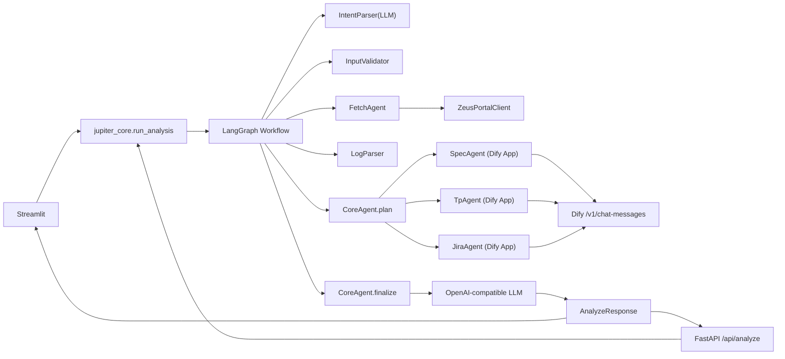
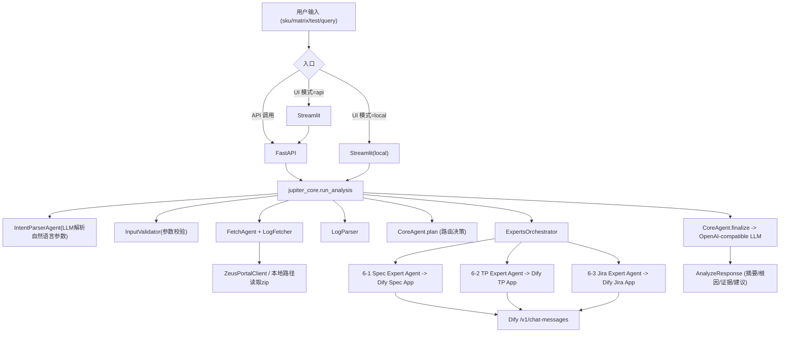
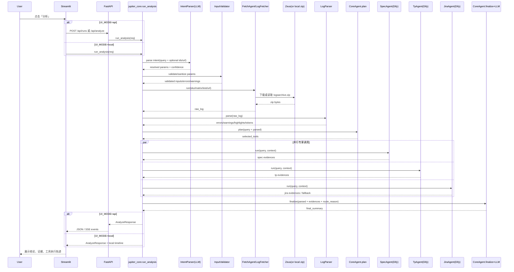

# Jupiter（Zeus 日志 + Dify RAG + CoreAgent 编排）

Jupiter 是一个面向 SSD/NVMe 测试分析的后端系统：  
输入 `sku/matrix_id/test_id + 用户问题`，自动获取 Zeus 日志、解析关键信号、按需调用 Dify 知识库（Spec/TP/Jira），最后输出结构化结论。

---

## 1. 项目目标

- 统一分析入口：日志、规范、代码、缺陷信息在同一条流程里汇总。
- 面向真实内网：支持公司 TLS 根证书、Zeus Cookie 认证、OpenAI-compatible 接入。
- 失败可降级：Zeus/Dify/LLM 任一异常不崩溃，仍返回可读结果。

---

## 2. 架构概览



### 2.1 概念图1：模块调用关系（谁负责什么）



### 2.2 概念图2：单次请求时序（谁调用了谁）



---

## 3. 目录结构（关键部分）

```text
jupiter/
  jupiter_core/
    workflow.py
  apps/
    backend/
      api/routes.py
      graph/nodes.py
      agents/
        core_agent.py
        fetch_agent.py
        intent_parser_agent.py
        spec_agent.py
        tp_agent.py
        jira_agent.py
      tools/
        zeus_portal.py
        dify_client.py
      services/
        input_validator.py
        log_fetcher.py
        log_parser.py
      core/
        config.py
        tls.py
    frontend/
      streamlit_app.py
```

---

## 4. 快速启动（Docker）

1. 准备环境变量

```bash
cp .env.example .env
```

2. 填写 `.env` 关键项（至少）

- `ZEUS_TEST_URL_TEMPLATE`
- `ZEUS_SKU_DEFAULT`（如链接包含 `{sku}`）
- `ZEUS_COOKIE`
- `DIFY_BASE_URL`
- `DIFY_SPEC_APP_KEY`
- `DIFY_TP_APP_KEY`
- `DIFY_JIRA_APP_KEY`
- `OPENAI_API_KEY` / `OPENAI_BASE_URL` / `OPENAI_MODEL`
- `OFFICETOOL_CA_CERT_PATH`（内网 TLS 需要时）
- `COMPANY_CA_CERT_FILENAME`（公司 Docker 构建需要私有根证书时）

3. 启动

```bash
docker compose up --build
```

4. 访问

- Backend Swagger: `http://localhost:8000/docs`
- Streamlit: `http://localhost:8502`

### 4.1 公司内网 Docker 构建（解决 `CERTIFICATE_VERIFY_FAILED`）

如果在 `docker compose up --build` 期间看到 `pip install ... CERTIFICATE_VERIFY_FAILED`：

1. 把公司根证书放入仓库目录 `certs/`（例如 `certs/CompanyInternalRootCA.cer`）。
2. 在 `.env` 设置：

```env
COMPANY_CA_CERT_FILENAME=CompanyInternalRootCA.cer
```

3. 如公司要求内网 PyPI，再补充：

```env
PIP_INDEX_URL=https://<your-internal-pypi>/simple
PIP_TRUSTED_HOST=<your-internal-pypi-host>
```

也可配置多个 trusted host（逗号分隔）：

```env
PIP_TRUSTED_HOST=pypi.org,files.pythonhosted.org,pypi.python.org
```

4. 重新构建：

```bash
docker compose build --no-cache
docker compose up -d
```

---

## 5. 本地运行（非 Docker）

1. 创建并进入虚拟环境（建议 Python 3.11）

```bash
cd /Users/dalizhou/openaicdx/jupiter
# macOS / Linux
python3.11 -m venv .venv
source .venv/bin/activate
```

Windows PowerShell：

```powershell
cd C:\Users\yourname\openaicdx\jupiter
py -3.11 -m venv .venv
.\.venv\Scripts\Activate.ps1
```

如果 PowerShell 不允许执行 `Activate.ps1`，可跳过激活，直接用 `.venv` 里的 Python：

```powershell
cd C:\Users\yourname\openaicdx\jupiter
.\.venv\Scripts\python.exe -m pip install -e .
```

2. 在虚拟环境中安装依赖

```bash
python -m pip install -U pip
python -m pip install -e .
```

3. 准备环境变量

```bash
cp .env.example .env
```

按需填写 `.env`（与 Docker 相同，尤其是 `DIFY_*`、`ZEUS_*`、`OPENAI_*`、`OFFICETOOL_CA_CERT_PATH`）。

4. 在虚拟环境中启动后端

```bash
uvicorn apps.backend.main:app --host 0.0.0.0 --port 8000
```

5. 启动前端（新开一个终端，并再次激活同一个 `.venv`）

默认 `JUPITER_UI_MODE=api`（前端通过 FastAPI 调用）。  
如果你想本地直连核心工作流（调试时更快），把 `.env` 里改成 `JUPITER_UI_MODE=local`。
本地 `api` 模式建议 `JUPITER_BACKEND=http://127.0.0.1:8000`；Docker 下保持 `http://backend:8000`。

```bash
streamlit run apps/frontend/streamlit_app.py --server.port 8502
```

Windows（不激活 venv 的直接启动方式）：

```powershell
# 终端1：后端
.\.venv\Scripts\python.exe -m uvicorn apps.backend.main:app --host 0.0.0.0 --port 8000

# 终端2：前端
.\.venv\Scripts\python.exe -m streamlit run apps/frontend/streamlit_app.py --server.port 8502
```

6. 访问地址

- Backend Swagger: `http://localhost:8000/docs`
- Streamlit: `http://localhost:8502`

---

## 6. 环境变量说明

| 变量 | 说明 | 示例 |
|---|---|---|
| `ZEUS_TEST_URL_TEMPLATE` | Zeus 测试页面模板（支持 sku/matrix/test 拼接） | `https://zeus.example.com/{sku}/test/{matrix_id}/{test_id}` |
| `ZEUS_SKU_DEFAULT` | 默认 SKU（模板包含 `{sku}` 且请求未传 sku 时使用） | `nx1` |
| `ZEUS_LOG_ZIP_NAME` | 日志压缩包名 | `logsarchive.zip` |
| `ZEUS_COOKIE` | 从浏览器复制的完整 Cookie 值 | `session=...; token=...` |
| `ZEUS_EXTRA_HEADERS_JSON` | 额外请求头（JSON） | `{"X-Token":"abc"}` |
| `DIFY_BASE_URL` | Dify 服务地址（可不带 `/v1`） | `http://10.22.57.219:28882` |
| `DIFY_SPEC_APP_KEY` | Spec 知识库 App Key | `app-...` |
| `DIFY_TP_APP_KEY` | TP/代码知识库 App Key | `app-...` |
| `DIFY_JIRA_APP_KEY` | Jira 知识库 App Key | `app-...` |
| `OPENAI_API_KEY` | 总结 LLM 的 API Key | `sk-...` |
| `OPENAI_BASE_URL` | OpenAI-compatible 基地址 | `https://api.openai.com/v1` |
| `OPENAI_MODEL` | 总结模型 | `gpt-4o-mini` |
| `OPENAI_TEMPERATURE` | 全局温度；若 Azure/兼容部署不支持 temperature，保持为空 | `` |
| `OPENAI_INTENT_TEMPERATURE` | IntentParser 温度；不支持 temperature 的部署请留空 | `` |
| `OPENAI_FINALIZE_TEMPERATURE` | Finalize 温度；不支持 temperature 的部署请留空 | `` |
| `OFFICETOOL_CA_CERT_PATH` | 内网根证书路径（非常重要） | `/certs/CompanyInternalRootCA.cer` |
| `COMPANY_CA_CERT_FILENAME` | Docker 构建时注入到镜像信任链的证书文件名（位于 `certs/`） | `CompanyInternalRootCA.cer` |
| `PIP_INDEX_URL` | Docker 构建使用的 Python 包源（内网环境可指向私有镜像） | `https://pypi.example.com/simple` |
| `PIP_EXTRA_INDEX_URL` | 额外 Python 包源 | `https://extra.example.com/simple` |
| `PIP_TRUSTED_HOST` | pip 信任主机（可多个，逗号分隔） | `pypi.org,files.pythonhosted.org,pypi.python.org` |
| `CACHE_TTL_SECONDS` | 请求缓存秒数 | `600` |
| `JUPITER_UI_MODE` | Streamlit 调用模式：`api` 或 `local` | `api` |
| `JUPITER_BACKEND` | Streamlit 在 `api` 模式下的后端地址（支持逗号分隔多地址，按顺序回退） | `http://127.0.0.1:8000,http://backend:8000` |

---

## 7. 公司内网证书（TLS）

如果你们网络要求自有根证书，请设置：

```env
OFFICETOOL_CA_CERT_PATH=/absolute/path/to/CompanyInternalRootCA.cer
```

Jupiter 会将该证书应用到以下请求：

- OpenAI-compatible LLM
- Dify API
- Zeus HTTPS 下载

### Docker 场景注意

镜像构建与运行是两条链路：

- 构建阶段（`pip install`）证书：使用 `certs/` + `COMPANY_CA_CERT_FILENAME`。
- 运行阶段（OpenAI/Dify/Zeus 请求）证书：使用 `OFFICETOOL_CA_CERT_PATH`。

如果你把证书直接放到镜像内（通过 `COMPANY_CA_CERT_FILENAME`），通常运行阶段可不再单独设置；  
若仍需显式指定，保证 `OFFICETOOL_CA_CERT_PATH` 指向容器内存在的证书路径。

---

## 8. Zeus Cookie 获取方式

1. 浏览器登录 Zeus 测试页面。  
2. 打开 DevTools -> Network。  
3. 选任一请求，复制 `Request Headers` 中 `Cookie` 的完整值。  
4. 写入 `.env`：

```env
ZEUS_COOKIE=...
```

如你的 Zeus 不是 `test_url/logsarchive.zip` 直连模式，可修改：  
`apps/backend/tools/zeus_portal.py` 的 `resolve_zip_url()`。

补充：`zeus_test_url` 也支持本地/共享目录路径（例如 Windows UNC：`\\\\server\\share\\...`）。  
若传入目录，系统会优先读取目录下的 `logsarchive.zip`，找不到时会尝试读取该目录第一个 `.zip` 文件。

---

## 9. 运行流程（一次请求）

1. `IntentParserAgent(LLM)`：从自然语言解析 `sku/matrix_id/test_id/zeus_test_url`。  
2. `InputValidator`：参数校验（必填、模板占位、格式），输出 `errors/warnings/resolved`。  
3. `FetchAgent`：按校验后的参数下载或读取日志 zip（失败时自动 fallback mock，并记录 reason）。  
4. `LogParser`：提取 `errors/warnings/highlights/tokens`。  
5. `CoreAgent.plan`：决定专家路由与轮次提示。  
6. `ExpertsOrchestrator`：并行调用专家：  
   - `6-1 Spec Expert Agent`（Dify Spec App）  
   - `6-2 TP Expert Agent`（Dify TP App）  
   - `6-3 Jira Expert Agent`（Dify Jira App）  
7. `CoreAgent.finalize(LLM)`：聚合日志证据 + 专家证据，输出中文结构化结论。  
8. API 返回 `AnalyzeResponse`（摘要、根因、证据、建议、下一步）。  

### 9.1 哪些节点是 LLM 驱动

- LLM 驱动：`IntentParserAgent`、`CoreAgent.finalize`、各 Expert 调用的 Dify（Dify 内部一般为检索+LLM）。  
- 非 LLM（确定性工具/规则）：`InputValidator`、`FetchAgent`、`LogParser`、`CoreAgent.plan`（当前实现）。  

---

## 10. API 示例

```bash
curl -X POST http://localhost:8000/api/analyze \
  -H "Content-Type: application/json" \
  -d '{
    "request_id": "req-001",
    "user_query": "这个 timeout waiting for controller ready 可能根因是什么？",
    "sku": "nx1",
    "matrix_id": "123",
    "test_id": "456"
  }'
```

实时多 Agent 轨迹（推荐）：

1. 启动一次 run：

```bash
curl -X POST http://localhost:8000/api/runs \
  -H "Content-Type: application/json" \
  -d '{
    "request_id": "req-rt-001",
    "user_query": "分析这个用例失败原因",
    "sku": "NX1",
    "matrix_id": "40255",
    "test_id": "5894735"
  }'
```

2. 查状态和结果：

```bash
curl http://localhost:8000/api/runs/<run_id>
```

3. 订阅事件流（SSE）：

```bash
curl -N http://localhost:8000/api/runs/<run_id>/events
```

---

## 11. 测试与开发

```bash
pytest -q
```

当前最小保障：

- URL 拼接与 zip 处理测试
- Dify 兼容字段解析测试
- Graph happy path 测试
- CoreAgent 路由与 finalize 测试

---

## 12. 安全建议

- 不要把真实 `app key`、`cookie`、内部地址提交到仓库。  
- 若密钥曾在截图/聊天中暴露，请立即轮换。  
- `.env` 仅用于本地或内网环境，生产请用密钥管理系统。  
