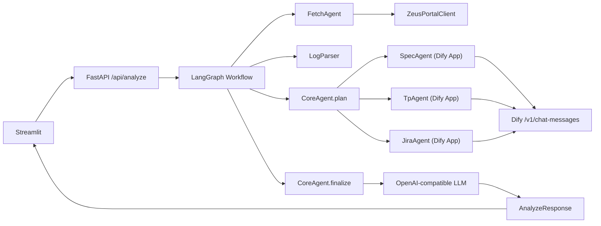

# Jupiter（Zeus 日志 + Dify RAG + CoreAgent 编排）

Jupiter 是一个面向 SSD/NVMe 测试分析的后端系统：  
输入 `matrix_id/test_id + 用户问题`，自动获取 Zeus 日志、解析关键信号、按需调用 Dify 知识库（Spec/TP/Jira），最后输出结构化结论。

---

## 1. 项目目标

- 统一分析入口：日志、规范、代码、缺陷信息在同一条流程里汇总。
- 面向真实内网：支持公司 TLS 根证书、Zeus Cookie 认证、OpenAI-compatible 接入。
- 失败可降级：Zeus/Dify/LLM 任一异常不崩溃，仍返回可读结果。

---

## 2. 架构概览



---

## 3. 目录结构（关键部分）

```text
jupiter/
  apps/
    backend/
      api/routes.py
      graph/nodes.py
      agents/
        core_agent.py
        fetch_agent.py
        spec_agent.py
        tp_agent.py
        jira_agent.py
      tools/
        zeus_portal.py
        dify_client.py
      services/
        log_fetcher.py
        log_parser.py
      core/
        config.py
        tls.py
    frontend/
      streamlit_app.py
```

---

## 4. 快速启动（Docker）

1. 准备环境变量

```bash
cp .env.example .env
```

2. 填写 `.env` 关键项（至少）

- `ZEUS_TEST_URL_TEMPLATE`
- `ZEUS_COOKIE`
- `DIFY_BASE_URL`
- `DIFY_SPEC_APP_KEY`
- `DIFY_TP_APP_KEY`
- `DIFY_JIRA_APP_KEY`
- `OPENAI_API_KEY` / `OPENAI_BASE_URL` / `OPENAI_MODEL`
- `OFFICETOOL_CA_CERT_PATH`（内网 TLS 需要时）
- `COMPANY_CA_CERT_FILENAME`（公司 Docker 构建需要私有根证书时）

3. 启动

```bash
docker compose up --build
```

4. 访问

- Backend Swagger: `http://localhost:8000/docs`
- Streamlit: `http://localhost:8502`

### 4.1 公司内网 Docker 构建（解决 `CERTIFICATE_VERIFY_FAILED`）

如果在 `docker compose up --build` 期间看到 `pip install ... CERTIFICATE_VERIFY_FAILED`：

1. 把公司根证书放入仓库目录 `certs/`（例如 `certs/CompanyInternalRootCA.cer`）。
2. 在 `.env` 设置：

```env
COMPANY_CA_CERT_FILENAME=CompanyInternalRootCA.cer
```

3. 如公司要求内网 PyPI，再补充：

```env
PIP_INDEX_URL=https://<your-internal-pypi>/simple
PIP_TRUSTED_HOST=<your-internal-pypi-host>
```

4. 重新构建：

```bash
docker compose build --no-cache
docker compose up -d
```

---

## 5. 本地运行（非 Docker）

1. 安装依赖

```bash
cd /Users/dalizhou/openaicdx/jupiter
python -m pip install -e .
```

2. 准备环境变量

```bash
cp .env.example .env
```

按需填写 `.env`（与 Docker 相同，尤其是 `DIFY_*`、`ZEUS_*`、`OPENAI_*`、`OFFICETOOL_CA_CERT_PATH`）。

3. 启动后端

```bash
uvicorn apps.backend.main:app --host 0.0.0.0 --port 8000
```

4. 启动前端（新开一个终端）

```bash
streamlit run apps/frontend/streamlit_app.py --server.port 8502
```

5. 访问地址

- Backend Swagger: `http://localhost:8000/docs`
- Streamlit: `http://localhost:8502`

---

## 6. 环境变量说明

| 变量 | 说明 | 示例 |
|---|---|---|
| `ZEUS_TEST_URL_TEMPLATE` | Zeus 测试页面模板（用 matrix/test 拼接） | `https://zeus.example.com/test/{matrix_id}/{test_id}` |
| `ZEUS_LOG_ZIP_NAME` | 日志压缩包名 | `logsarchive.zip` |
| `ZEUS_COOKIE` | 从浏览器复制的完整 Cookie 值 | `session=...; token=...` |
| `ZEUS_EXTRA_HEADERS_JSON` | 额外请求头（JSON） | `{"X-Token":"abc"}` |
| `DIFY_BASE_URL` | Dify 服务地址（可不带 `/v1`） | `http://10.22.57.219:28882` |
| `DIFY_SPEC_APP_KEY` | Spec 知识库 App Key | `app-...` |
| `DIFY_TP_APP_KEY` | TP/代码知识库 App Key | `app-...` |
| `DIFY_JIRA_APP_KEY` | Jira 知识库 App Key | `app-...` |
| `OPENAI_API_KEY` | 总结 LLM 的 API Key | `sk-...` |
| `OPENAI_BASE_URL` | OpenAI-compatible 基地址 | `https://api.openai.com/v1` |
| `OPENAI_MODEL` | 总结模型 | `gpt-4o-mini` |
| `OFFICETOOL_CA_CERT_PATH` | 内网根证书路径（非常重要） | `/certs/CompanyInternalRootCA.cer` |
| `COMPANY_CA_CERT_FILENAME` | Docker 构建时注入到镜像信任链的证书文件名（位于 `certs/`） | `CompanyInternalRootCA.cer` |
| `PIP_INDEX_URL` | Docker 构建使用的 Python 包源（内网环境可指向私有镜像） | `https://pypi.example.com/simple` |
| `PIP_EXTRA_INDEX_URL` | 额外 Python 包源 | `https://extra.example.com/simple` |
| `PIP_TRUSTED_HOST` | pip 信任主机（证书策略严格时使用） | `pypi.example.com` |
| `CACHE_TTL_SECONDS` | 请求缓存秒数 | `600` |

---

## 7. 公司内网证书（TLS）

如果你们网络要求自有根证书，请设置：

```env
OFFICETOOL_CA_CERT_PATH=/absolute/path/to/CompanyInternalRootCA.cer
```

Jupiter 会将该证书应用到以下请求：

- OpenAI-compatible LLM
- Dify API
- Zeus HTTPS 下载

### Docker 场景注意

镜像构建与运行是两条链路：

- 构建阶段（`pip install`）证书：使用 `certs/` + `COMPANY_CA_CERT_FILENAME`。
- 运行阶段（OpenAI/Dify/Zeus 请求）证书：使用 `OFFICETOOL_CA_CERT_PATH`。

如果你把证书直接放到镜像内（通过 `COMPANY_CA_CERT_FILENAME`），通常运行阶段可不再单独设置；  
若仍需显式指定，保证 `OFFICETOOL_CA_CERT_PATH` 指向容器内存在的证书路径。

---

## 8. Zeus Cookie 获取方式

1. 浏览器登录 Zeus 测试页面。  
2. 打开 DevTools -> Network。  
3. 选任一请求，复制 `Request Headers` 中 `Cookie` 的完整值。  
4. 写入 `.env`：

```env
ZEUS_COOKIE=...
```

如你的 Zeus 不是 `test_url/logsarchive.zip` 直连模式，可修改：  
`apps/backend/tools/zeus_portal.py` 的 `resolve_zip_url()`。

---

## 9. 运行流程（一次请求）

1. `FetchAgent` 下载并合并日志文本（失败时自动使用 mock log）。  
2. `LogParser` 产出 `errors/warnings/highlights/tokens`。  
3. `CoreAgent.plan` 决定调用哪些专家（Spec/TP/Jira）与检索轮次提示。  
4. 专家并行调用各自 Dify App，返回证据片段。  
5. `CoreAgent.finalize` 汇总日志线索 + 专家证据，生成最终中文报告。  
6. API 返回 `AnalyzeResponse`（摘要、根因、证据、建议、下一步）。  

---

## 10. API 示例

```bash
curl -X POST http://localhost:8000/api/analyze \
  -H "Content-Type: application/json" \
  -d '{
    "request_id": "req-001",
    "user_query": "这个 timeout waiting for controller ready 可能根因是什么？",
    "matrix_id": "123",
    "test_id": "456"
  }'
```

---

## 11. 测试与开发

```bash
pytest -q
```

当前最小保障：

- URL 拼接与 zip 处理测试
- Dify 兼容字段解析测试
- Graph happy path 测试
- CoreAgent 路由与 finalize 测试

---

## 12. 安全建议

- 不要把真实 `app key`、`cookie`、内部地址提交到仓库。  
- 若密钥曾在截图/聊天中暴露，请立即轮换。  
- `.env` 仅用于本地或内网环境，生产请用密钥管理系统。  
